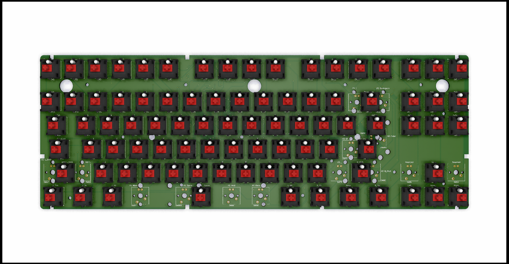
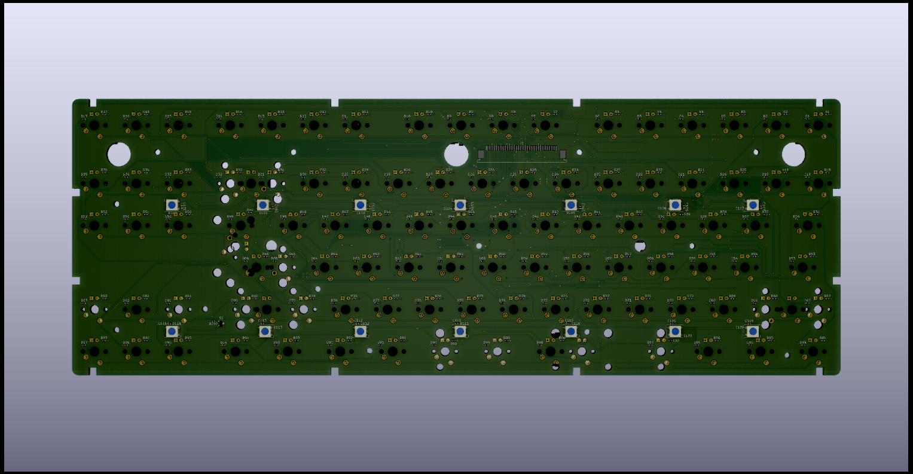

# WASD-keyboard

80% mechanical switch keyboard

## Goal Features
 - QMK-compatibility
 - WASD-libre controller compatibility
 - Mechanical compatibility with existing popular 80% keyboards (i.e XD87 from KRepublic)
 - ANSI, ISO and JIS layouts on one PCB
 - Regulated backlight
 - RGB-highlight
 
 The work is in progress...